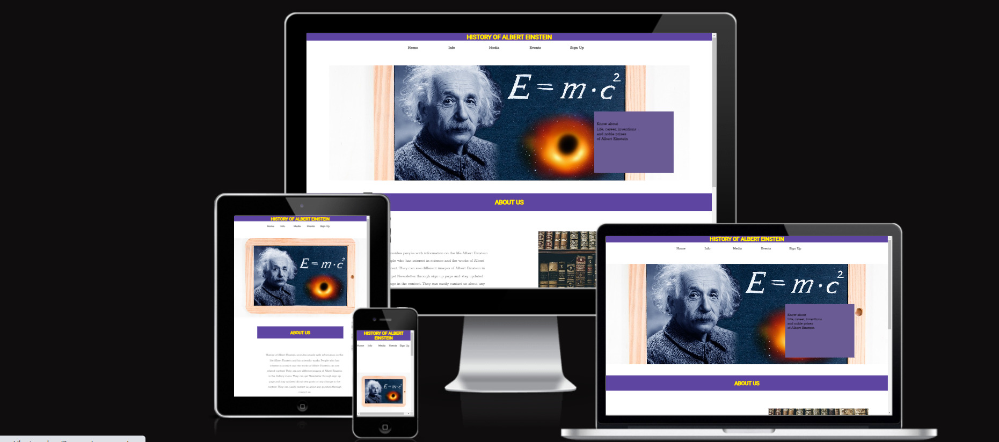

# History of Albert Einstein

The website provides content to people on the life and works of Albert Einstein.This website can be helpful for students and people who has interest in foundations of science and physics. It also provides an oppertunity to stay updated with the lastest content.

You can view the live project website [here](https://zahid295.github.io/History-of-Albert-Einstein/)

## User experience

### User Stories

##### First time user goals

- As a first time user, I want to know the purpose of this website and what it provides.
- As a first time user, I want to know the life background of Albert Einstein.
- As a first time user, I want to discover the life events of Albert Einstein.
- As a first time user, I want to learn the scientific works of Albert Einstein.
- As a first time user, I am looking for pictures of Albert Einstein and his Qoutes.
  
##### Returner user goals

- As a returner user, I want to quickly discovery a method to contact.
- As a returner user, I want to follow this website on social media to get latest content.
- As a returner user, I want to sign up for newsletter.
  
### Design

##### Color scheme

The main colors used are gold and Ultra violet.

- Warmth, optimism, and positivism are all known to be evoked by the color gold. It is used for headings because it improves aesthetic appeal.

- Ultra violet background is used to make the website catchy for users and to grab user attention it is being used as background for headings.
  
##### Typography

 Two types of fonts are used throughout the website.

- Rokkitt font is used for paragraphs and logo and sans-serif is used in case Rokkitt font does not support.
- Roboto is used for headings as the font promotes friendliness and open curves and sans-serif if Roboto does not work.
