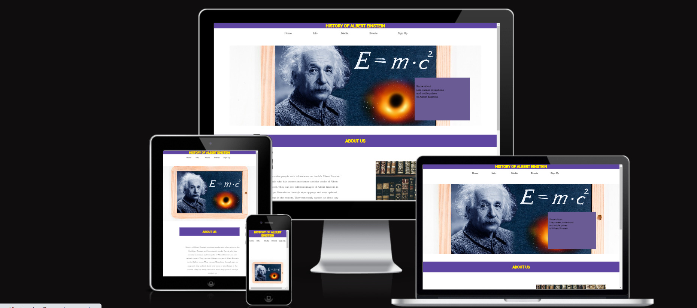

# History of Albert Einstein

The website provides content to people on the life and works of Albert Einstein.This website can be helpful for students and people who has interest in foundations of science and physics. It also provides an oppertunity to stay updated with the lastest content.

You can view the live project website [here](https://zahid295.github.io/History-of-Albert-Einstein/)

## User experience

### User Stories

##### First time user goals

- As a first time user, I want to know the purpose of this website and what it provides.
- As a first time user, I want to know the life background of Albert Einstein.
- As a first time user, I want to discover the life events of Albert Einstein.
- As a first time user, I want to learn the scientific works of Albert Einstein.
- As a first time user, I am looking for pictures of Albert Einstein and his Qoutes.
  
##### Returner user goals

- As a returner user, I want to quickly discovery a method to contact.
- As a returner user, I want to follow this website on social media to get latest content.
- As a returner user, I want to sign up for newsletter.
  
### Design

##### Color scheme

The main colors used are gold and Ultra violet.

- Warmth, optimism, and positivism are all known to be evoked by the color gold. It is used for headings because it improves aesthetic appeal.

- Ultra violet background is used to make the website catchy for users and to grab user attention it is being used as background for headings.
  
##### Typography

 Two types of fonts are used throughout the website.

- Rokkitt font is used for paragraphs and logo and sans-serif is used in case Rokkitt font does not support.
- Roboto is used for headings as the font promotes friendliness and open curves and sans-serif if Roboto does not work.
  
### Wireframes

- Home page Wireframe [Click here to view](assets/readme_photos/home-page.png)
- Info page Wireframe [Click here to view](assets/readme_photos/info-page.png)
- Media page Wireframe [Click here to view](assets/readme_photos/media-page.png)
- Events page Wireframe [Click here to view](assets/readme_photos/events-page.png)
- Sign Up page Wireframe [Click here to view](assets/readme_photos/signup-page.png)
- Mobile - Home page Wifreframe [Click here to view](assets/readme_photos/mobile-home-page.png)
  
## Features

- An easy and clear navigation through website.
- Accessiblity for all types of users.
- Responsive on desktops, tablets and smartphones.
- Sign up page for people to get NewsLetter.
- Gallery with Albert Einstein pictures.
- Social media links in footer of each page for users to fellow up for latest information.
- Contact me section for any query.

## Technologies used

### Languages

- HTML
- CSS3
  
### Frameworks, Libraries and Programes used

- [Font Awesome](https://fontawesome.com/)-Social media icons for this website came from Font   awesome.
- [Google Fonts](https://fonts.google.com/) - Fonts for this website are from Google Fonts
- [Codeanywhere](https://codeanywhere.com/solutions/collaborate) - Codeanywhere was used as IDE.
- [Git](https://git-scm.com/) -  Git was used for version control.
- [GitHub](https://github.com) - GitHub was used to store project.
- [Balsamiq](https://balsamiq.com/) - Wireframes were made using Balsamiq.
- [Pixabay](https://pixabay.com/), [Canva](https://www.canva.com/) and [Unsplash](https://unsplash.com/) - were used for all images in the website.
- [Am I Responsive](https://ui.dev/amiresponsive) - was used to see that site is responsive on     different screen sizes. A screenshot is taken from Am I Responsive.

## Testing

Every page of the project was validated using the W3C Markup Validator and W3C CSS Validator Services to make sure there were no syntax issues.

- [W3C Markup Validator Results]()
- [W3C CSS Validator Results]()
- [Lighthouse Tool Results]()
- Tested on the desktop versions of Chrome, Opera, and Microsoft Edge.
- Chrome Developer Tools are used to test responsiveness on the following devices: Desktop, and laptop, Surface Duo, iPad Air, iPad Mini, iPhone 12 Pro, iPhone XR, iPhone SE, Samsung Galaxy S8+, Samsung Galaxy S20 Ultra.
  
### Testing User Stories from User Experience Section

#### User Story Testing

##### First time user Goals

1. As a first time user, I want to know the purpose of this website and what it provides.

- Each page has navigation so that users may quickly and easily browse the website and discover all the information they need.

2. As a first time user, I want to know the life background of Albert Einstein.

- User can easily find information about life background of Albert Einstein on Info page that is clear and easily understandable.

3. As a first time user, I want to discover the life events of Albert Einstein.

- Life timeline chart is provided on Events page to discover the life events of Albert Einstein.

4. As a first time user, I want to learn the scientific works of Albert Einstein.

- Scientific works are described on Info page to easily find with the heading.

5. As a first time user, I am looking for pictures of Albert Einstein and his Qoutes.

- Gallery page provides with pictures and Qoutes of Albert Einstein to those who are interested.

##### Returner user Goals

1. As a returner user, I want to quickly discovery a method to contact.

- User can find contact us Form on Sign up page, below Sign up section with the heading of Contact US to ask any question. User can also find Email adress on the same page to contact and ask about any query.

2. As a returner user, I want to follow this website on social media to get latest content.

- User can find social media Contact detalis in Footer of each page.

3. As a returner user, I want to sign up for newsletter.

- Sign Up Form is provied on sign up page to easily loacte the form to sign up and get Newsletter.
